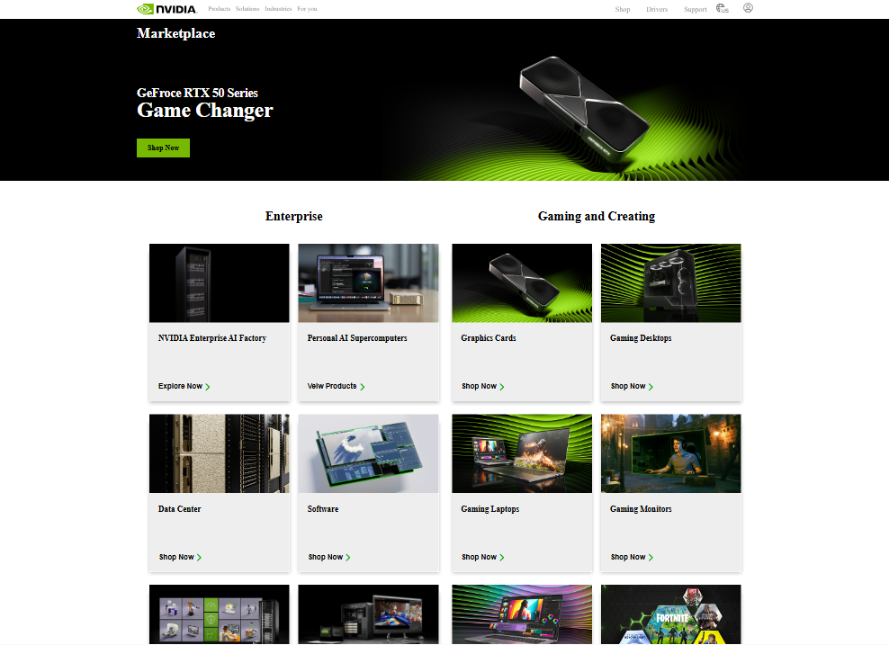
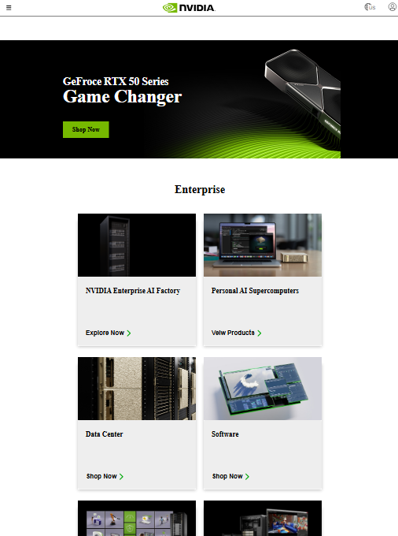
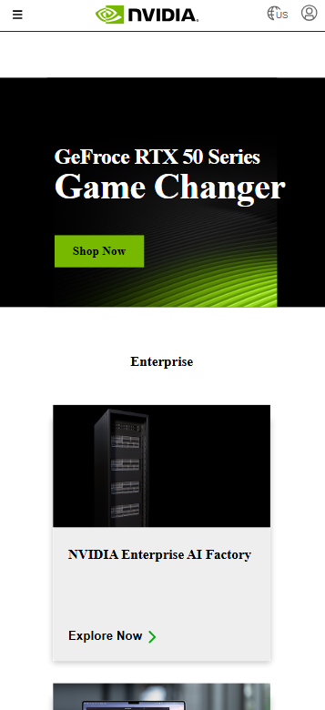

# NVIDIA Marketplace

## Table of contents

-   [Overview](#overview)
    -   [Screenshot](#screenshot)
    -   [Links](#links)
-   [My process](#my-process)
    -   [Built with](#built-with)
    -   [What I learned](#what-i-learned)
    -   [Useful resources](#useful-resources)
-   [Author](#author)

**Note: Delete this note and update the table of contents based on what sections you keep.**

## Overview

### Screenshot

### Links

-   Solution URL: [Add solution URL here](https://github.com/Douzhebag/ForTrainee.git)
-   Live Site URL: [Add live site URL here](https://douzhebag.github.io/ForTrainee/Exercise-12-Nvidia-Marketplace/)

## My process

### Built with

-   Semantic HTML5 markup
-   CSS custom properties
-   Flexbox
-   Grid
-   Mobile-first workflow

### What I learned

-   Responsive design support all device

### Useful resources

-   [Google Fonts](https://fonts.google.com/) - Used the Outfit font family from here for this project.

## Author
 [@Sila](https://github.com/Douzhebag/ForTrainee.git)
